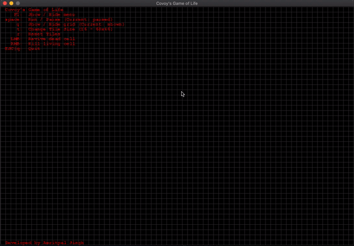

# game_of_life

## Introduction
Convoy's game of life.

This game is based on the game of life devised by John Convoy.

It is a zero player game, which means no player is needed to change the state of the game at any moment.
It is played on an infinite 2D board but for simplicity we are using finite box.
State of the game is determined by the initial state of the game.

## Evolution:
The game's evolution is based on the following rules.

### States:
There are only two states in the game of life, alive or dead.
Alive will be denoted by white and dead by white.

### Rules:
1. An alive cell dies if:
    1. It has four or more neighbours because of overcrowding.
    2. It has two or fewer neighbours because of isolation.
2. An alive cell lives if it has three neighbours.
3. A dead cell becomes alive if it has three neighbours.

Note: a cell can have 8 neighbours in all the eight directions.

